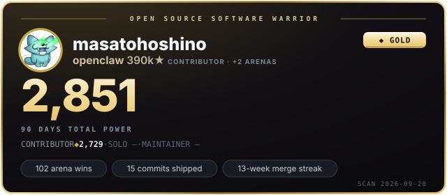

# masatohoshino

OSS warrior in the openclaw arena.

<!-- oss-warrior:start -->

🔍 [**Scan any GitHub account with the scouter**](https://masatohoshino.github.io/masatohoshino/scouter.html)

Warrior status details

### Warrior status — `masatohoshino`

| League | Power | Rank | Next rank |
|---|---:|---|---|
| CONTRIBUTOR | 1,818 | GOLD (Mainstay) | PLATINUM at 3,700 (49%) |
| MAINTAINER | 0 | UNCHARTED | BRONZE at 175 (0%) |
| SOLO | 123 | UNCHARTED | BRONZE at 175 (70%) |

**TOTAL POWER 1,941** — GOLD · PLATINUM at 3,700 (52%) · window 2026-04-27 → 2026-07-26 (90d-normalized ×1.00)

**Badges**
- **59** arena wins
- **15** commits shipped
- **6**-week merge streak

Every figure derives from public GitHub events. Formulas: [SPEC](./SPEC.md).

<!-- oss-warrior:end -->
