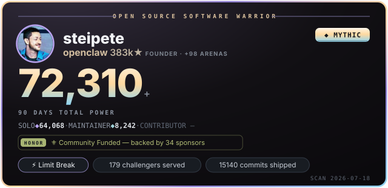
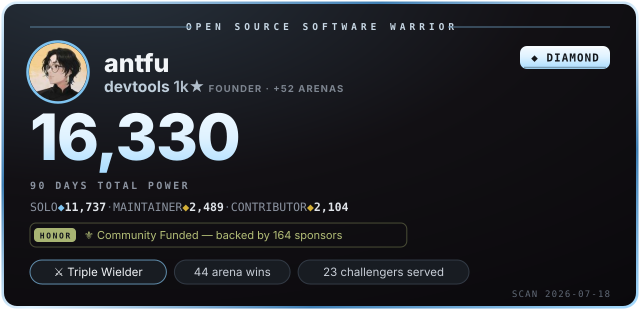

# masatohoshino

OSS warrior in the openclaw arena.

<!-- oss-warrior:start -->

### ⚡ Scouter readings

Warrior status details

### Warrior status — `masatohoshino`

| League | Power | Rank | Next rank |
|---|---:|---|---|
| CONTRIBUTOR | 1,707 | GOLD (Mainstay) | PLATINUM at 3,700 (46%) |
| MAINTAINER | 0 | UNCHARTED | BRONZE at 175 (0%) |
| SOLO | 0 | UNCHARTED | BRONZE at 175 (0%) |

**TOTAL POWER 1,707** — GOLD · PLATINUM at 3,700 (46%) · window 2026-04-19 → 2026-07-18 (90d-normalized ×1.00)

**Badges**
- **52** arena wins
- **5**-week merge streak

Every figure derives from public GitHub events. Formulas: [SPEC](./SPEC.md).

<!-- oss-warrior:end -->
